# Style Transfer

Style transfer allows you to take famous paintings, and recreate your own images in their styles! The network learns the underlying techniques of those paintings and figures out how to apply them on its own. This model was trained on the styles of famous paintings and is able to transfer those styles to other images and [even videos](https://www.youtube.com/watch?v=xVJwwWQlQ1o)!

Was just fun project to apply models that were already trained. 

A checkpoint file is a model that already has tuned parameters. By using this checkpoint file, we won't need to train the model and can get straight to applying it.

Trained model source

https://github.com/lengstrom/fast-style-transfer

The checkpoints were trained on the following paintings:

- Rain Princesss, by [Leonid Afremov](https://afremov.com/Leonid-Afremov-bio.html)
- La Muse, by [Pablo Picasso](https://en.wikipedia.org/wiki/Pablo_Picasso)
- Udnie by [Francis Picabia](https://en.wikipedia.org/wiki/Francis_Picabia)
- Scream, by [Edvard Munch](https://en.wikipedia.org/wiki/Edvard_Munch)
- The Great Wave off Kanagawa, by [Hokusai](https://en.wikipedia.org/wiki/Hokusai)
- The Shipwreck of the Minotaur, by [J.M.W. Turner](https://en.wikipedia.org/wiki/J._M._W._Turner)

Supporting Materials

- [Rain Princess checkpoint](https://video.udacity-data.com/topher/2017/January/587d1865_rain-princess/rain-princess.ckpt)
- [La Muse checkpoint](https://video.udacity-data.com/topher/2017/January/588aa800_la-muse/la-muse.ckpt)
- [Udnie checkpoint](https://video.udacity-data.com/topher/2017/January/588aa846_udnie/udnie.ckpt)
- [Scream checkpoint](https://video.udacity-data.com/topher/2017/January/588aa883_scream/scream.ckpt)
- [Wave checkpoint](https://video.udacity-data.com/topher/2017/January/588aa89d_wave/wave.ckpt)
- [Wreck checkpoint](https://video.udacity-data.com/topher/2017/January/588aa8b6_wreck/wreck.ckpt)

### Original images:

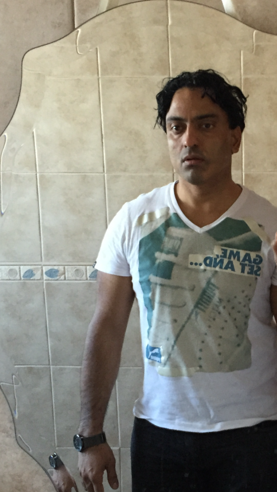

### La Muse, by [Pablo Picasso](https://en.wikipedia.org/wiki/Pablo_Picasso)

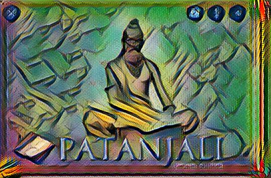

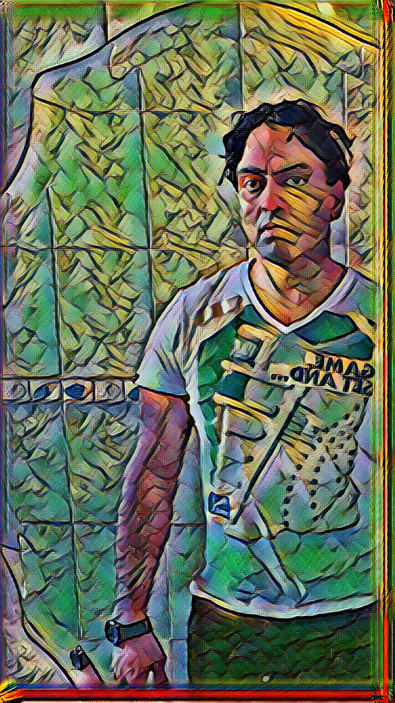

### Rain Princesss, by [Leonid Afremov](https://afremov.com/Leonid-Afremov-bio.html)

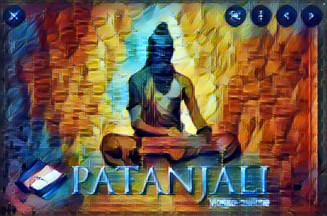

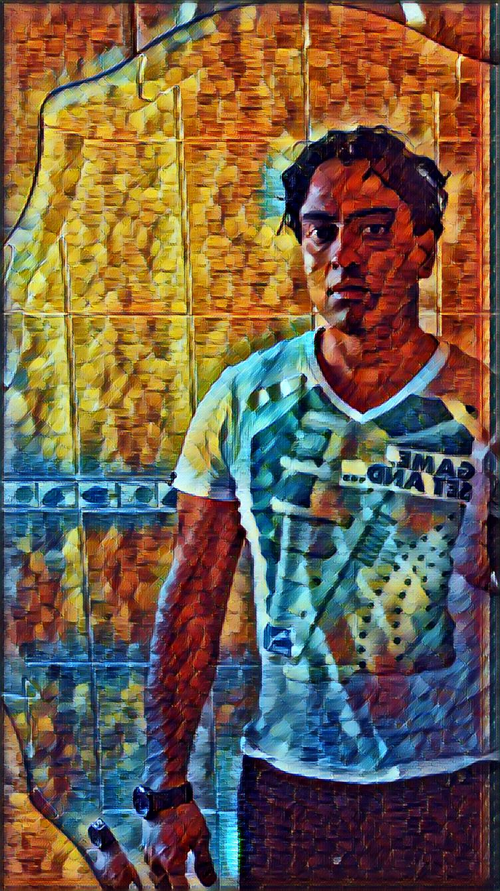

### Scream, by [Edvard Munch](https://en.wikipedia.org/wiki/Edvard_Munch)

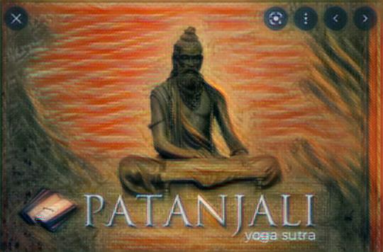

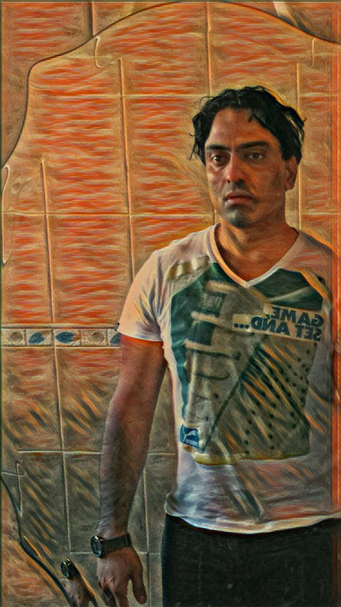

### Udnie by [Francis Picabia](https://en.wikipedia.org/wiki/Francis_Picabia)

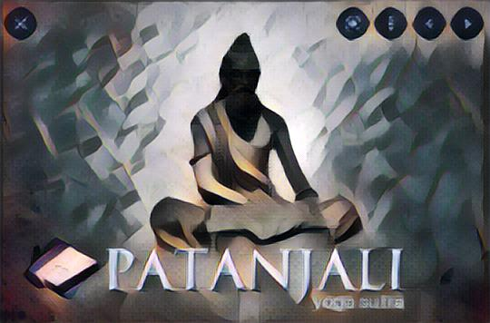

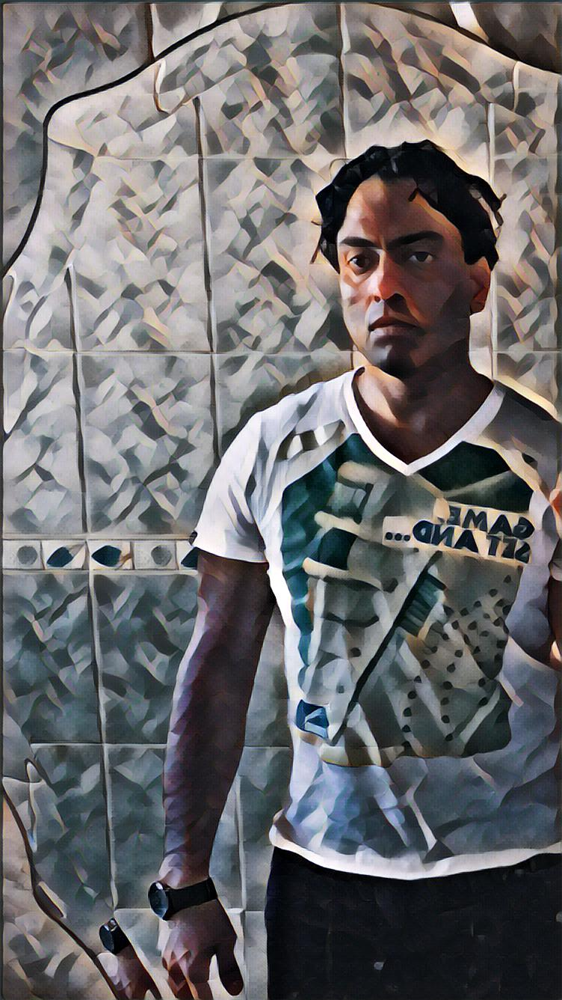

### The Great Wave off Kanagawa, by [Hokusai](https://en.wikipedia.org/wiki/Hokusai)

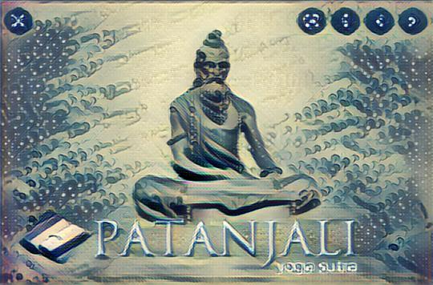

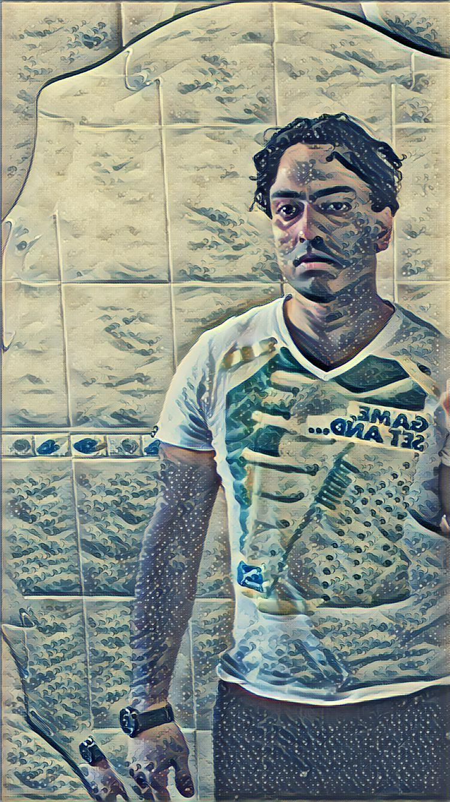

### The Shipwreck of the Minotaur, by [J.M.W. Turner](https://en.wikipedia.org/wiki/J._M._W._Turner)

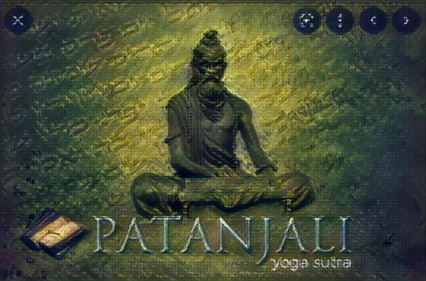

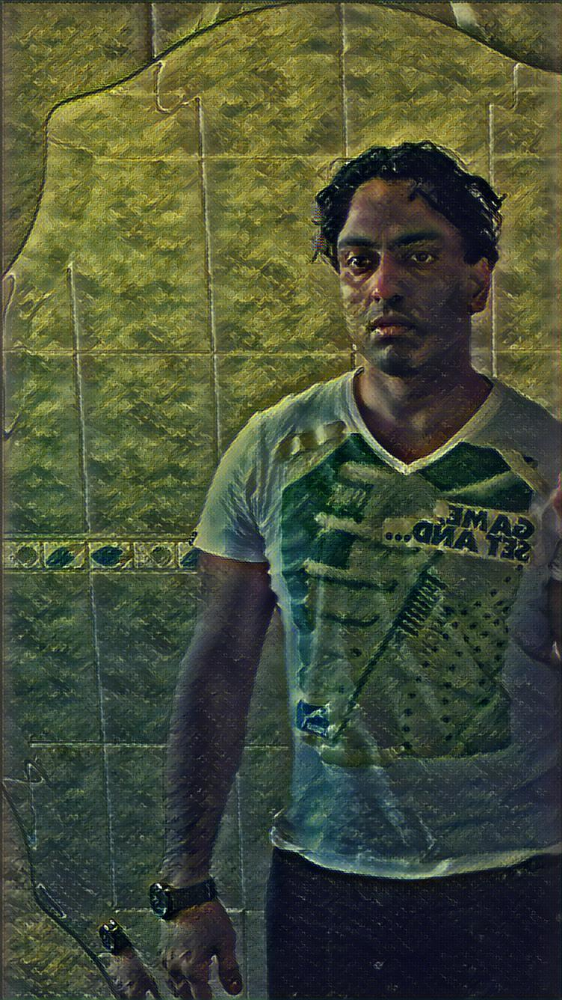

